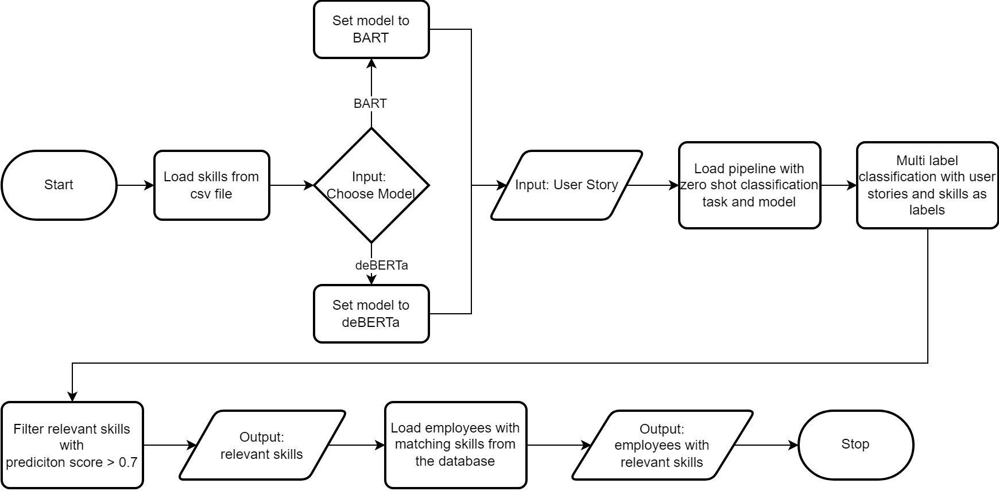

# Thesis Project

This README file contains all the necessary information for setting up and using the project.

1. [Set up the database](#1-set-up-the-databases)
2. [Run the pipeline](#2-run-pipeline)
3. [Documentation about the directory structure](#3-directory-structure)

In this project the models [BART](https://huggingface.co/facebook/bart-large-mnli) and [DeBERTa](https://huggingface.co/MoritzLaurer/DeBERTa-v3-base-mnli-fever-anli) were used.

my development environment:
- CPU:	12th Gen Intel(R) Core(TM) i7-12700K
- RAM:	32,0 GB
- GPU: NVIDIA GeForce RTX 4070 Ti 12 GB RAM
- Windows 11

# 1. Set up the databases
## 1.1 Set up MySQL Database (TAWOS)

For the setup, please follow the [installation instructions of the TAWOS database](https://github.com/SOLAR-group/TAWOS?tab=readme-ov-file#installation-instructions).


### 1.1.1 Restarting/Connecting to MySQL
The following MySQL database setup/properties were necessary in my case but may vary depending on your environment.

The following command starts the server (**You might have to use a console with admin rights**):  
```"C:\Program Files\MySQL\MySQL Server 8.0\bin\mysqld" --console```

Properties:
- localhost 3306
- user: root
- password: 1234
- database: mysql

## 1.2 Set up PostgreSQL  Database (employee database)
First you need to run a docker postgres instance like this:  
`docker run --name some-postgres -e POSTGRES_PASSWORD=mysecretpassword -d postgres`

I used the following command to add port mapping and mount a local directory for database persistence.  
```docker run --name some-postgres -e POST-GRES_PASSWORD=mysecretpassword -p 5432:5432 -v D:\postgres-data:/var/lib/postgresql/data -d postgres```

### 1.2.1 Using the dump file
The database was exported into an SQL dump file, located inside the DB/ folder.
First copy the dump file into the container:  
`docker cp /path/to/postgres_dump.sql some-postgres:/postgres_dump.sql`

Restore the database using the dump file with the following command:  
`docker exec -it some-postgres psql -U postgres -f /postgres_dump.sql`

### 1.2.2 set up without dump file
Otherwise, you could also set up a fresh database through this code (you still need a postgres connection)
1. Create skill table  
   `create table skills (
   skill_id SERIAL PRIMARY KEY,
   skill VARCHAR(100)
   )`
2. Create role table  
   `create table roles (
   role_id SERIAL PRIMARY KEY,
   role VARCHAR(100)
   )`
3. Create employee table  
   `create table employees (
   employee_id SERIAL PRIMARY KEY,
   first_name VARCHAR(50),
   last_name VARCHAR(50),
   role_id int references roles(role_id)
   )`
4. Create Proficiency Level  
   `CREATE TYPE proficiency AS ENUM ('BEGINNER', 'INTERMEDIATE', 'PROFESSIONAL')
   create table employee_skills (
   employee_id int references employees(employee_id),
   skill_id int references skills(skill_id),
   proficiency_lvl proficiency
   )`
5. Run script `DB/dbGenerate.py`

# 2. Run Pipeline
1. Open the Thesis folder in a terminal (not the IDE terminal, if it doesn't support cursors).  
   On windows the basic cmd.exe worked.
2. Activate venv `venv\Scripts\activate.bat`
3. Run script `python Pipeline\pipeline.py`

# 3. Directory Structure
The project is organized as follows:
### Zero-Shot Classification with the synthesized data
````
.
├── Classification_Synth/
│   ├── ClassifierOutput/
│   ├── GroundTruth/
│   ├── generate.py
│   ├── truth.csv
│   ├── userStories.csv
│   └── ZeroShotClassificator.py
````
The `Classification_Synth` Package consists of multiple functions. The center of attention is the
`ZeroShotClassificator.py`. The script uses the synthesized user stories (`userStories.csv`) and the skills of the employee dataset
and does a zero-shot classification.
In the `ClassifierOutput` the resulting txt and csv files are saved.
The `Ground Truth` contains resulting metrics (for bart and deberta) in a csv file, which are used for comparison in later stages.

### Zero-Shot Classification with data from the TAWOS database
````
├── Classification_TAWOS/
│   ├── assets/
│   ├── ClassifierOutput/
│   ├── final_assets/
│   ├── GroundTruth/
│   ├── ExtractAllUserStories.py
│   ├── ReduceAndGroup.py
│   ├── ZeroShotClassificator.py
│   └── ZeroShotClassificatorLooped.py
````
The classification time can take around 3-5h on an NVIDIA 4070Ti

For this classification data extracted from the TAWOS database through `ExtractAllUserStories.py`.
It is essential to reduce, group or both through the `ReduceAndGroup.py` script.
In the assets folder is a `cleaned.csv` (which contains the components reduced by hand)
as well as a `grouped_comps.yml` file which helps in the grouping process in the `ReduceAndGroup.py` script
The `final_asstets` folder contains the user stories and the components after reducing/grouping which are used for the
zero-shot classification as well as the output_csv and output_txts.

There are two scripts for the zero-shot classification. The first uses the ray library to not run out of VRAM,
the other one loops the classification. It depends on the machine, which one runs faster.

### Zero-Shot Classification with data from the TAWOS database and the skills from the employee database before and after fine-tuning
````
├── Classification_TAWOS_Synth/  
│   ├── assets/
│   ├── PostFineTuning/
│   ├── PreFineTuning/
│   ├── compare_two_prediction_sets.py
│   ├── display_entailments.py
│   ├── generate_metrics_table.py
│   ├── plots_histogram.py
│   ├── select_random_user_stories.py
│   ├── sort_data.py
│   ├── truth.csv
│   └── Zero_Shot_Classification.py
````
The `assets/` folder contains a csv file which contains 25 random user stories (origning from TAWOS). These are randomly
selected through the `select_random_user_stories.py` script.  
The `PostFineTuning/` and `PreFineTuning/` folders contain the resulting predictions of the `Zero_Shot_Classification.py` script.  
Other than that, the folder contains different scripts for generating metrics or evaluations.

### Development of the employee database
````
├── DB/
│   ├── datasets/
│   ├── GenerationOfStories/
│   ├── output/
│   ├── addDescription.py
│   ├── csvGenerator.py
│   ├── dbGenerate.py
│   ├── generateSkillTable.py
│   └── postgres_dump.sql
````
The `DB/` folder contains the code used to create the employee database.
Therefore, there were a csv files for:
- random names,
- a batch of [roles and role descriptions](https://www.kaggle.com/datasets/anujrajawat/itjobs-and-skills),
- a portion of the [roles](https://www.kaggle.com/datasets/anujrajawat/itjobs-and-skills) and which were matches with [skills](https://www.kaggle.com/datasets/zamamahmed211/skills) -> matched manually
- a batch of [skills](https://www.kaggle.com/datasets/zamamahmed211/skills)

The `dbGenerate.py` script generates the data for the employee database. The setup of the database,
if no dump is available is described in [here](#122-set-up-without-dump-file)

### Fine-Tuning
````
├── FineTuning/
│   ├── FinalRuns_PreTrained/
│   ├── FinalRuns_PreTrained_bart/
│   ├── FinalRuns_PreTrained_deberta/
│   ├── output_csv
│   ├── output_txt
│   ├── fine_tuning.ipynb
│   ├── metrics.py
│   └── truth.csv
````
The `FineTuning/` folder contains the resulting models from fine-tuning runs and the prediction outputs of zero-shot classifications with these models
In the `fine_tuning.ipynb` is the preparation and the actual fine-tuning located as well as a zero-shot classification

I have uploaded three complete models as usual. However, due to the repository size it was not possible to add the remaining models on GitHub.
### Pipeline
````
├── Pipeline
│   ├── pipeline.py
│   └── pipeline_flowchart.png
````
The `pipeline.py` script allows users to select a model, input a user story,
and perform zero-shot classification on a predefined set of skills.
Based on the positively classified (entailment) skills, the script filters individuals proficient in those specific skills.



### Helper Functions
```
├── CsvConverter.py
└── MetricsGenerator.py
```

The `CsvConverter.py` script converts text files into CSV format,
while the `MetricsGenerator.py` script generates metrics based on a given ground truth and a prediction csv.